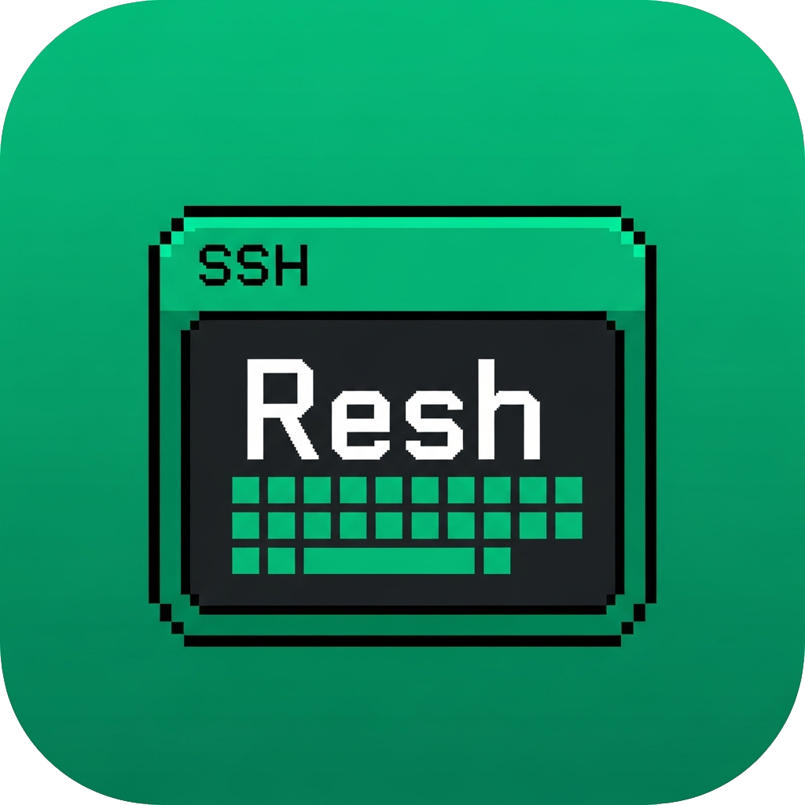

<p align="center">
  
</p>

<h1 align="center">Resh</h1>

<p align="center">A modern, fast and secure multi-tab SSH client for Windows &amp; macOS, built with Tauri&nbsp;2 and React&nbsp;19.</p>

<p align="center">
  <a href="LICENSE"></a>
  <a href="https://github.com/fonlan/resh/releases"></a>
  <a href="https://github.com/fonlan/resh/releases"></a>
  <a href="https://github.com/fonlan/resh/actions/workflows/macos-ci.yml"></a>
  
  
  
</p>

<p align="center"><strong>English</strong> | <a href="README.zh-CN.md">简体中文</a></p>

---

Resh is a professional SSH client for developers: multi-tab sessions, split views, built-in SFTP, a remote file editor, an AI assistant that can operate on your servers, and WebDAV configuration sync — all in one lightweight desktop app. Configuration is fully portable, so you can sync it across machines.

## Table of Contents

- [Features](#features)
- [Platform Support](#platform-support)
- [Installation](#installation)
- [Usage](#usage)
- [Configuration](#configuration)
- [Building from Source](#building-from-source)
- [Releases &amp; In-App Updates](#releases--in-app-updates)
- [Contributing](#contributing)
- [License](#license)

## Features

- **Multi-tab sessions &amp; split view** — run many SSH sessions side by side; drag tabs to reorder, and switch between left-right, top-bottom, or four-pane layouts without interrupting live connections.
- **Server &amp; authentication management** — password or SSH key auth (key *content* is stored, not paths, for true portability), server groups, connection cloning, and per-connection auto-execute commands, environment variables and keep-alive.
- **Routing &amp; port forwarding** — connect through HTTP/SOCKS5 proxies or SSH jumphosts; configure local-to-remote port forwarding per connection.
- **Built-in SFTP** — file browser with favorites, transfer queue and concurrency tuning, server-side copy, custom commands, and per-server editor associations. Edit remote files in the built-in Monaco editor or with your local editor, with conflict protection when the remote file changes.
- **AI assistant** — chat with an agent that can execute commands, read files, transfer files over SFTP and drive your terminal. Supports Anthropic, OpenAI-compatible and GitHub Copilot channels, model lookup from the models.dev catalog, per-server prompts, tool confirmation (with YOLO mode) and context compaction.
- **Code snippets** — save reusable command snippets and send them to any session.
- **Terminal UX** — Canvas or WebGL renderer, customizable font / cursor / scrollback, select-to-copy right-click mode, terminal session recording (raw or plain text) and session export.
- **WebDAV sync** — sync servers, authentications, proxies and snippets across machines with per-item conflict resolution.
- **In-app updates** — automatic update checks (every ~6 h, plus manual), SHA-256 verified downloads, proxy-aware, and a safe restart that restores your tabs.
- **Themes &amp; localization** — light / dark / system plus Sunset Orange and Sage Forest themes; English and 简体中文 UI.
- **Desktop polish** — frameless window, single-instance mode, window-state and tab restore after updates, and a welcome screen with recent connections.

## Platform Support

| Platform | Architecture | Distribution |
| --- | --- | --- |
| Windows 10+ | x64 | Portable `.exe` (unsigned, no installer) |
| macOS 10.15+ | Intel | `.dmg` (unsigned / unnotarized) |
| macOS 11+ | Apple Silicon | `.dmg` (unsigned / unnotarized) |

## Installation

All builds are published as GitHub Releases: <https://github.com/fonlan/resh/releases>

### Windows

1. Download `Resh-<version>-windows-x86_64.exe`.
2. Run it from any writable folder — no installation required. Configuration is stored in `%AppData%\Resh\`.

### macOS

1. Download the `.dmg` matching your architecture (`-aarch64` for Apple Silicon, `-x86_64` for Intel).
2. Open the DMG and drag **Resh.app** into `/Applications`.
3. Releases are **unsigned / unnotarized**, so macOS Gatekeeper may block the first launch. Remove the quarantine attribute:

   ```bash
   xattr -d com.apple.quarantine /Applications/Resh.app
   ```

   Alternatively, right-click the app in Finder and choose **Open**.

   > In-app updates only clear `com.apple.quarantine` on the newly installed, checksum-verified `Resh.app` — they do not change system Gatekeeper policy.

### Verify Downloads

```bash
sha256sum -c SHA256SUMS.txt
```

## Usage

### Connect

- Click **+** in the tab bar and pick a configured server, or use **Quick Connect** with `ip`, `host`, or `user@host`.
- Recent connections are shown on the welcome screen.

### Manage Configuration

Open **Settings** (gear icon) and configure:

| Tab | What to configure |
| --- | --- |
| Servers | SSH servers, groups, routing, port forwarding, keep-alive, auto-execute commands, environment variables, SFTP favorite paths |
| Authentication | Passwords and SSH keys |
| Proxies | HTTP/SOCKS5 proxies (with optional auth and SSL override) |
| Snippets | Reusable command snippets |
| AI | AI channels and models, additional prompts, chat context, tool confirmations |
| SFTP | Download path, transfer concurrency and profiles, editor associations, custom commands |
| Sync | WebDAV URL, proxy, sync now |
| General | Theme, language, terminal font/cursor/renderer, tab width, recording, confirmations, software update |
| About | Version, repository, license, tech stack |

### SFTP &amp; Editor

Open a server's SFTP sidebar to browse files, drag entries into favorites, queue transfers, or open remote files in the built-in editor. Local editor associations and custom shell commands are configurable per server or globally.

### AI Assistant

1. In **AI Settings**, add a channel (Anthropic, OpenAI-compatible, or GitHub Copilot) and a model — use the models.dev catalog to auto-fill context size.
2. Pick a server and start a chat. The agent can run commands, read files and transfer files; dangerous operations ask for confirmation.

### WebDAV Sync

1. Configure a WebDAV URL (and optional proxy) in Settings → Sync.
2. Use **Sync Now** for a manual sync; the app also syncs automatically on startup.
3. Conflicts are resolved item-by-item (keep local / use remote).

## Configuration

Resh stores its data in a platform-specific application data directory:

```
Windows: %AppData%\Resh\
macOS:   ~/Library/Application Support/Resh/

Resh/
├── local.json        # Local-only settings (theme, WebDAV, updates, confirmations, …)
├── sync.json         # Servers / authentications / proxies / snippets (synced via WebDAV)
├── config.db         # Local application database (AI sessions, recent connections, …)
└── logs/             # Application and connection logs
```

Sync strategy: items in `local.json` override matching UUIDs in `sync.json`; only `sync.json` is uploaded to and downloaded from WebDAV.

## Building from Source

### Prerequisites

- **Node.js** 22.12.x and **npm** 10.9.x (see `.nvmrc` / `package.json`)
- **Rust** 1.88+ (see `rust-toolchain.toml`)
- Platform build dependencies:
  - Windows: Microsoft C++ Build Tools and WebView2
  - macOS: Xcode Command Line Tools

### Quick Start

```bash
git clone https://github.com/fonlan/resh.git
cd resh
npm ci
npm run tauri-dev
```

### Useful Scripts

| Command | Description |
| --- | --- |
| `npm run dev` | Run the Vite dev server only |
| `npm run tauri-dev` | Run Resh in development mode |
| `npm run build` | Type-check and build the frontend |
| `npm run tauri-build` | Build the production app (`src-tauri/target/release/Resh.exe`) |
| `npm run build:macos` | Build a macOS DMG (`CI=true` for CI-like unsigned builds) |
| `npm run check:release-version -- vX.Y.Z` | Verify the tag matches all version sources |
| `npm run check:updater-assets -- --tag vX.Y.Z --dir ./assets` | Validate updater asset names + checksums |
| `npm run ci:pin-actions` | Verify third-party GitHub Actions are SHA-pinned |
| `npm run test:updater-helpers` | Run isolated Windows/macOS updater helper tests |
| `npm run sftp:baseline -- -ServerHost <host> -User <user>` | SFTP performance harness (Windows PowerShell) |

## Releases &amp; In-App Updates

Pushing a version tag (`v*`) is the **only** automatic GitHub Release entry point (`.github/workflows/release.yml`).

Before tagging, keep the three version sources identical (semver, no leading `v`):

| File | Field |
| --- | --- |
| `package.json` | `"version"` |
| `src-tauri/Cargo.toml` | `package.version` |
| `src-tauri/tauri.conf.json` | `version` |

```bash
npm run check:release-version -- vX.Y.Z
git tag vX.Y.Z && git push origin vX.Y.Z
```

Each release publishes exactly four assets — these names are the **in-app updater API**, do not rename them:

| Asset | Description |
| --- | --- |
| `Resh-vX.Y.Z-windows-x86_64.exe` | Portable Windows x64 binary (unsigned) |
| `Resh-vX.Y.Z-macos-aarch64.dmg` | Apple Silicon DMG (unsigned / unnotarized) |
| `Resh-vX.Y.Z-macos-x86_64.dmg` | Intel DMG (unsigned / unnotarized) |
| `SHA256SUMS.txt` | SHA-256 checksums (GNU `sha256sum` format) |

Updater behavior: auto-check is on by default (Settings → General → Software update; checks shortly after startup, then every ~6 h), stable releases only, proxy-aware. Windows replaces the portable EXE in place (keep it in a writable folder); macOS swaps the validated `Resh.app` and clears quarantine on it. Full contract: [scripts/checklists/updater-release-contract.md](scripts/checklists/updater-release-contract.md).

## Contributing

Contributions are welcome! Please open an issue or submit a pull request.

### Reporting Security Issues

Please report security vulnerabilities **privately** to the maintainers instead of filing a public issue.

## License

[MIT](LICENSE) © fonlan
